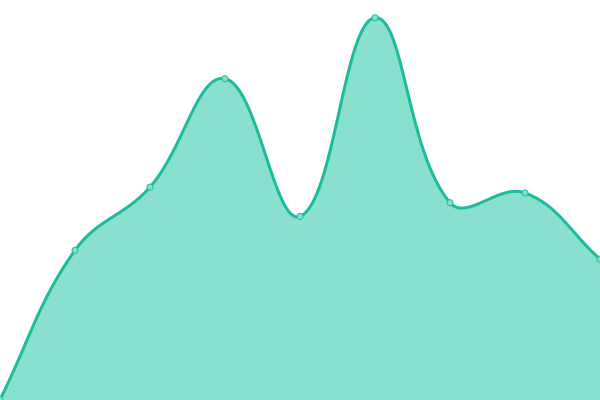
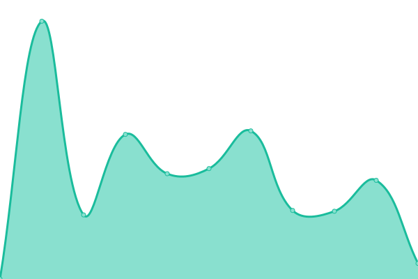

# Performance and availability monitoring

## <!--live status--> **🟩 All systems operational**

<!--start: status pages-->
<!-- This summary is generated by Upptime (https://github.com/upptime/upptime) -->
<!-- Do not edit this manually, your changes will be overwritten -->
<!-- prettier-ignore -->
| URL | Status | History | Response Time | Uptime |
| --- | ------ | ------- | ------------- | ------ |
|  [Hem](https://www.hem.com) | 🟩 Up | [hem.yml](https://github.com/hemdesignstudio/upptime/commits/HEAD/history/hem.yml) | 

 294ms
     
 | 

<a href="https://hemdesignstudio.github.io/upptime/history/hem">100.00%</a>
    

|  [Hem Stage](https://stage.hem.com) | 🟩 Up | [hem-stage.yml](https://github.com/hemdesignstudio/upptime/commits/HEAD/history/hem-stage.yml) | 

 888ms
     
 | 

<a href="https://hemdesignstudio.github.io/upptime/history/hem-stage">100.00%</a>
    

|  [Hem Beta](https://beta.hem.com) | 🟩 Up | [hem-beta.yml](https://github.com/hemdesignstudio/upptime/commits/HEAD/history/hem-beta.yml) | 

 956ms
     
 | 

<a href="https://hemdesignstudio.github.io/upptime/history/hem-beta">100.00%</a>
    

|  [Hem Commerce](https://hem-commerce.herokuapp.com/api/v1/health/) | 🟩 Up | [hem-commerce.yml](https://github.com/hemdesignstudio/upptime/commits/HEAD/history/hem-commerce.yml) | 

 518ms
     
 | 

<a href="https://hemdesignstudio.github.io/upptime/history/hem-commerce">100.00%</a>
    

<!--end: status pages-->

## 📄 License

- Powered by: [Upptime](https://github.com/upptime/upptime)
- Code: [MIT](./LICENSE) © [Hem](https://www.hem.com/)
- Data in the `./history` directory: [Open Database License](https://opendatacommons.org/licenses/odbl/1-0/)
