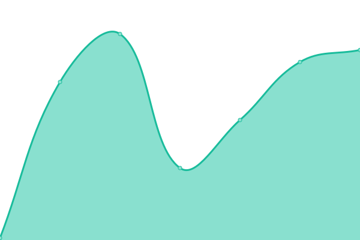
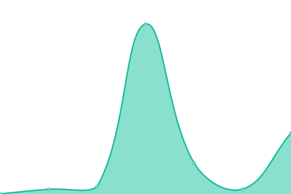
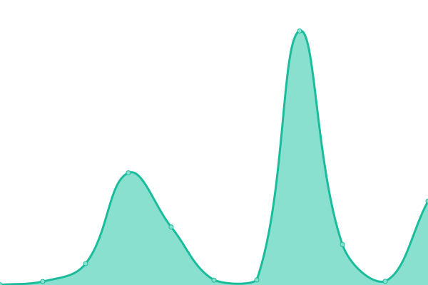
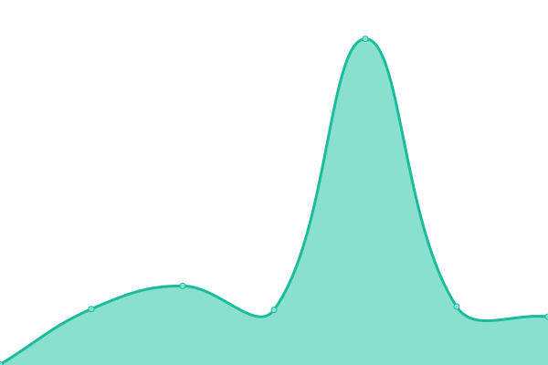

# Performance and availability monitoring

## <!--live status--> **🟩 All systems operational**

<!--start: status pages-->
<!-- This summary is generated by Upptime (https://github.com/upptime/upptime) -->
<!-- Do not edit this manually, your changes will be overwritten -->
<!-- prettier-ignore -->
| URL | Status | History | Response Time | Uptime |
| --- | ------ | ------- | ------------- | ------ |
|  [Hem B2C](https://hem.com/) | 🟩 Up | [hem-b2-c.yml](https://github.com/hemdesignstudio/upptime/commits/HEAD/history/hem-b2-c.yml) | 

 86ms
     
 | 

<a href="https://status.hem.com/history/hem-b2-c">100.00%</a>
    

|  [Hem B2C EU](https://hem.com/en-eu/) | 🟩 Up | [hem-b2-c-eu.yml](https://github.com/hemdesignstudio/upptime/commits/HEAD/history/hem-b2-c-eu.yml) | 

 622ms
     
 | 

<a href="https://status.hem.com/history/hem-b2-c-eu">100.00%</a>
    

|  [Hem B2C US](https://hem.com/en-us/) | 🟩 Up | [hem-b2-c-us.yml](https://github.com/hemdesignstudio/upptime/commits/HEAD/history/hem-b2-c-us.yml) | 

 384ms
     
 | 

<a href="https://status.hem.com/history/hem-b2-c-us">100.00%</a>
    

|  [Hem B2C CA](https://hem.com/en-ca/) | 🟩 Up | [hem-b2-c-ca.yml](https://github.com/hemdesignstudio/upptime/commits/HEAD/history/hem-b2-c-ca.yml) | 

 309ms
     
 | 

<a href="https://status.hem.com/history/hem-b2-c-ca">100.00%</a>
    

|  [Hem B2B](https://pro.hem.com/) | 🟩 Up | [hem-b2-b.yml](https://github.com/hemdesignstudio/upptime/commits/HEAD/history/hem-b2-b.yml) | 

 166ms
     
 | 

<a href="https://status.hem.com/history/hem-b2-b">100.00%</a>
    

|  [Hem B2B EU](https://pro.hem.com/en-eu/) | 🟩 Up | [hem-b2-b-eu.yml](https://github.com/hemdesignstudio/upptime/commits/HEAD/history/hem-b2-b-eu.yml) | 

 172ms
     
 | 

<a href="https://status.hem.com/history/hem-b2-b-eu">100.00%</a>
    

|  [Hem B2B US](https://pro.hem.com/en-us/) | 🟩 Up | [hem-b2-b-us.yml](https://github.com/hemdesignstudio/upptime/commits/HEAD/history/hem-b2-b-us.yml) | 

 142ms
     
 | 

<a href="https://status.hem.com/history/hem-b2-b-us">100.00%</a>
    

|  [Hem B2C UK](https://pro.hem.com/en-gb/) | 🟩 Up | [hem-b2-c-uk.yml](https://github.com/hemdesignstudio/upptime/commits/HEAD/history/hem-b2-c-uk.yml) | 

 140ms
     
 | 

<a href="https://status.hem.com/history/hem-b2-c-uk">100.00%</a>
    

|  [Hem Pro Signup](https://pro-signup.hem.com/) | 🟩 Up | [hem-pro-signup.yml](https://github.com/hemdesignstudio/upptime/commits/HEAD/history/hem-pro-signup.yml) | 

 182ms
     
 | 

<a href="https://status.hem.com/history/hem-pro-signup">100.00%</a>
    

|  [Hem Commerce](https://commerce.hem.com/api/v1/health/) | 🟩 Up | [hem-commerce.yml](https://github.com/hemdesignstudio/upptime/commits/HEAD/history/hem-commerce.yml) | 

 518ms
     
 | 

<a href="https://status.hem.com/history/hem-commerce">100.00%</a>
    

|  [Search API](https://dq56azlcmuwh2i90p.a1.typesense.net/health/) | 🟩 Up | [search-api.yml](https://github.com/hemdesignstudio/upptime/commits/HEAD/history/search-api.yml) | 

 157ms
     
 | 

<a href="https://status.hem.com/history/search-api">100.00%</a>
    

<!--end: status pages-->

## 📄 License

- Powered by: [Upptime](https://github.com/upptime/upptime)
- Code: [MIT](./LICENSE) © [Hem](https://www.hem.com/)
- Data in the `./history` directory: [Open Database License](https://opendatacommons.org/licenses/odbl/1-0/)
